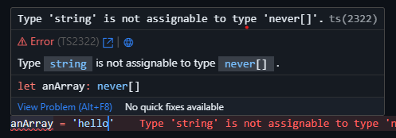

  
  <h1>Quick Guide on Learning TypeScript</h1>

<i>From zero to Expert</i>

Leave :star: if you like the Project

<strong>Linkedin</strong> Click here on [My Linkedin Profile](www.linkedin.com/in/keven-bardales) 
<strong>Email</strong> Click on the link and email me to [keven.bardales@gmail.com](https://mail.google.com/mail/?view=cm&source=mailto&to=keven.bardales@gmail.com)

## Index

- [Index](#index)

  - [Chaper-1 Concepts](#chapter-1)

    - [What is TypeScript?](#what-is-typescript)

  - [Chapter-2 Set Up TypeScript](#chapter-2)
    - [Set Up TypeScript and start using it on yout html](#set-up-typescript-and-start-using-it-on-your-html)
    - [Compiling TypeScript into JavaScript](#compiling-typescript-into-javascript)

---

### Chapter 1

#### What is TypeScript?

TypeScript adds additional syntax to JavaScript to support a tighter integration with your editor. Catch errors early in your editor.

##### JavaScript

Javascript lets this happen since its a loosely typed language

##### TypeScript

Typescript warns you about this.

**[⬆ Back to Index](#index)**

---

### Chapter 2

#### Set Up TypeScript and start using it on yout html

First lets install typescript globally on our folder.

Your folder directory/ `npm install typescript -g`

###### Lets create or first Typescript file using the `.ts` instead of `.js`

Javascript lets this happen since its a loosely typed language

###### Now lets write some TypeScript Code? oh Surprise this looks just as JavaScript code. But is it?

Well it may look like js but this is typeScript file so this means that in order for the browser to recognize this we need to compile this into JavaScript code. `TYPESCRIPT IS NOT RUNED IN EXECUTION` this means javascript wont do the job for you it will just warn you about any types mistakes. Pay close attention to this always.

###### Here is where the magic starts. See now this is TypeScript welcome!!!

Why would you want your array to go from being an array to a simple string saying hello? In a big project this is something that could slide in so Typescript warns you for that.

**[⬆ Back to Index](#index)**

---

#### Compiling TypeScript into JavaScript

As I told you the browser only recognizes JavaScript so let me show you how to compile this TypeScript Code.

your project folder/`tsc main.ts`

###### This will create a new file named `main.js` that will be the compiled .js file.

Notice how EVERYTHING you write on your Typescript file is still compiled even though you had errors. So one again TypeScript warns you however it stills compiles normally. So the array can still be converted into a string if you let it happen.

**[⬆ Back to Index](#index)**

---
